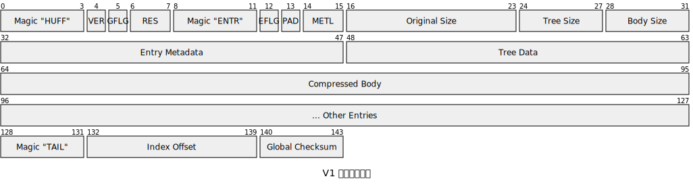

在第一篇博客中，我们介绍了使用 Huffman 算法实现压缩软件的目标和路线，并且进行了初始项目的搭建工作。在这一篇里，我们将实现单文件压缩功能，构建出整个项目的最小可行性产品。

# 文件格式设计

在编写代码之前，我们需要先设计一下文件的二进制格式。为了保证高效、可扩展和跨平台，我们采用**全局文件头+多文件条目（Entry）+全局文件尾
**的标准结构。所有的多字节证书统一使用**大端序**，这是网络传输和文件存储的行业标准。
这是我们设计 V1 版本的内存布局：



各个字段说明如下：

- **Magic "HUFF"**：整个文件的魔数，能够让我们的项目识别出这是一个能够读取的压缩包。
- **VER**：压缩文件版本号，目前是 `0x01`。
- **GFLG**：项目的全局功能标志位，用于标识是否加密、是否使用分卷压缩等功能。
- **RES**：保留字节，如果后续有新的特性，可以继续使用这两个字节；同时也能保证后续的内容能够按照 8 字节进行对齐，方便程序读写。
- **Magic "ENTR"**：每个文件条目的魔数，能让我们识别出这是一个文件条目的开始。
- **EFLG**：每个文件条目的标志位，标识是否是目录、是否使用 Canonical Huffman 存储。
- **PAD**：条目数据最后填充位数，压缩数据不一定是整字节，因此后面几位需要丢弃。
- **METL**：文件元信息的大小，V1 版本固定为 0，暂时不存储任何元信息。
- **Original Size**：原始文件大小，用于解压后进行简单校验。
- **Tree Size**：读取出的 Huffman 树的大小，因为 Huffman 树的大小不确定，所以要在这里进行标识。
- **Body Size**：同理，用于标识压缩后的文件大小。
- **Entry Metadata**：文件元信息，包括文件名、创建时间等。
- **Tree Data**：Huffman 树的二进制内容。
- **Compressed Body**：压缩后的文件内容。
- **Other Entries**：其余的 Entry，一个压缩包内可能包含多个文件，格式与前面定义一致。
- **Magic "TAIL"**：文件尾部的魔数，能够识别这是文件尾部的开始
- **Index Offset**：压缩文件索引的偏移量，这个功能为后续设计，用于快速预览压缩后的文件，暂时固定为 0。
- **Checksum**：使用 CRC 32 校验，保证文件内容没有在传输过程中遭到损坏。
  随着后续的开发，我们也会根据需要，变动文件格式和文件头的内容。

# 定义相关二进制结构

如果手动读写这样的二进制结构，那么我们需要非常繁琐的按字节进行读取，而且这么做容易出错。但是使用 Rust，我们可以借助 `binrw`
库，它允许我们像定义 JSON 一样通过声明式属性处理二进制内容。
而对于 `FLG` 部分，我们可以借助 `bitflags` 库来管理 Flag 字节里面的各个位。虽然我们在 V1 只支持单文件压缩，但是预留 Flag
接口可以方便将来扩展功能。

## 常量定义

首先，我们先把项目中必要的常量定义出来：

```rust
// crates/huffman_core/src/format/mod.rs

// 全局头、条目头、文件尾的魔数
pub const GLOBAL_HEADER_MAGIC: &[u8; 4] = b"HUFF";
pub const ENTRY_HEADER_MAGIC: &[u8; 4] = b"ENTR";
pub const FOOTER_MAGIC: &[u8; 4] = b"FOOT";

// 格式版本
pub const VERSION_1: u8 = 1;
pub const VERSION_CURRENT: u8 = VERSION_1;
```

## 标志位管理

为了避免手动操作 `0x01`、`0x02` 这样的标志位，我们引入 `bitflags` 库来管理 Flag 字节。首先打开
`crates/huffman_core/Cargo.toml`，在依赖里添加如下内容：

```toml
bitflags = "2.10.0"
```

然后编辑代码，给出 Flag 的对应：

```rust
// crates/huffman_core/src/format/v1.rs（部分）

use bitflags::bitflags;

bitflags! {
    /// 全局功能标志位
    #[derive(Copy, Clone, Eq, PartialEq, Debug, Ord, PartialOrd, Hash)]
    pub struct GlobalFlags: u8 {
        // 数据已加密
        const IS_ENCRYPTED = 0x01;

        // 是否使用 SHA-256 校验
        const USE_SHA256 = 0x02;

        // 是否是分卷压缩
        const IS_SPLIT = 0x04;
    }

    /// Entry 的功能标志位
    #[derive(Copy, Clone, Eq, PartialEq, Debug, Ord, PartialOrd, Hash)]
    pub struct EntryFlags: u8 {
        // 是否是目录
        const IS_DIR = 0x01;

        // 是否包含元信息
        const HAS_METADATA = 0x02;

        // 是否使用 Canonical
        const USE_CANONICAL = 0x04;
    }
}
```

这里面定义的功能特性，在这篇文章里面都用不到，它们只在后续的开发过程中有用。现在定义出来，是为了方便读者了解我们这个项目的功能。

## 全局文件头定义

在 `v1.rs` 中补充如下代码，定义全局文件头结构：

```rust
// crates/huffman_core/src/header.rs

use crate::constants::VERSION_1;
use binrw::{BinRead, BinWrite};

#[derive(BinRead, BinWrite, Debug, Clone, PartialEq)]
#[brw(big)] // 全局大端序
#[brw(magic = b"HUFF")] // binrw 只支持使用字面量定义魔数
pub struct GlobalHeader {
    /// 协议版本
    #[br(assert(version == VERSION_1, "Unsupported version: {}", version))]
    #[bw(assert(*version == VERSION_1, "Unsupported version: {}", version))]
    pub version: u8,

    /// 标志位 (映射为 bitflags 结构体)
    #[br(map = |bits: u8| GlobalFlags::from_bits_truncate(bits))]
    #[bw(map = |flags: &GlobalFlags| flags.bits())]
    pub flags: GlobalFlags,

    /// 保留字节 (必须为 0)
    #[br(assert(reserved == 0u16, "Reserved field must be 0"))]
    #[bw(assert(*reserved == 0u16, "Reserved field must be 0"))]
    pub reserved: u16,
}
```

上面的代码有一些需要注意的地方：

- `BinRead` 和 `BinWrite`：支持结构体进行二进制读写。
- `br`、`bw` 和 `brw`：用于定义二进制读取、写入以及读写的相关行为。
- `magic`：定义结构体的魔数；`binrw` 只支持通过**字面量**定义，所以这里只能写死为 `b"HUFF"`。
- `map`：相当于 `binrw` 在读写时的拦截器。读取时先读到原始的 `u8` 字面量，然后通过闭包转换成 `FeatureFlags`；写入时先将
  `FeatureFlags` 转换成 `u8` 类型，然后再写入文件。
- `assert`：在读取或写入时进行判断，如果判断失败就会报错。在读取时判断的是**字段本身**，但是在写入时判断的是字段的**引用**
  ，而引用无法直接与变量进行比较，因此需要进行**解引用**，这一点需要格外注意。

## 条目文件头的定义

继续在 `v1.rs` 中添加如下代码，定义每个条目的头部：

```rust
#[derive(BinRead, BinWrite, Debug, Clone, PartialEq)]
#[brw(big)] // 条目大端序
#[brw(magic = b"ENTR")]
pub struct EntryHeader {
    /// 标志位 (映射为 bitflags 结构体)
    #[br(map = |bits: u8| EntryFlags::from_bits_truncate(bits))]
    #[bw(map = |flags: &EntryFlags| flags.bits())]
    pub flags: EntryFlags,

    /// 数据填充位数（0-7）
    #[br(assert(pad < 8, "Padding bits must be less than 8"))]
    #[bw(assert(*pad < 8, "Padding bits must be less than 8"))]
    pub pad: u8,

    /// 元数据长度（字节）
    pub metadata_length: u16,

    /// 原始文件大小（字节）
    pub original_size: u64,

    /// Huffman 树大小（字节）
    pub huffman_tree_size: u32,

    /// 压缩后数据大小（字节）
    pub compressed_size: u32,
}
```

## 文件尾部的定义

向文件 `v1.rs` 添加如下内容：

```rust
/// 全局文件尾结构体
#[derive(BinRead, BinWrite, Debug, Clone, PartialEq)]
#[brw(big)]
#[brw(magic = b"TAIL")]
pub struct GlobalFooter {
    /// 索引表偏移量（字节）
    /// V1 版本固定填 0
    #[br(assert(index_offset == 0, "Index offset must be 0"))]
    #[bw(assert(*index_offset == 0, "Index offset must be 0"))]
    pub index_offset: u64,

    /// 索引表大小（字节）
    /// V1 版本固定填 0
    #[br(assert(index_size == 0, "Index size must be 0"))]
    #[bw(assert(*index_size == 0, "Index size must be 0"))]
    pub index_size: u64,

    /// 校验和
    pub checksum: u32,
}
```

## Huffman 树结构的定义

Huffman 算法是动态编码，对于每个不同的文件，字符出现的频率不同，生成的树（0/1 编码表）也完全不同。因此我们需要将 Huffman
树和压缩后的文件内容一起打包存储，否则解压软件无法正确还原数据。
关于如何存储 Huffman 树，最直接想到的方案是直接保存二叉树的节点和左右分支，但是这样在二进制文件中极其浪费空间，而且解析难度也会增加。最简单的方法是直接存储
**原始字符及其出现的频率**，而不保存树的拓扑结构。解压时，只需要读取这个频次表，再运行一遍和压缩时一样的构建算法，就能在内存中
100% 还原出那棵树。
频次表再内存中的字节分布如下：

- `Entry Count`（2 字节）：记录频次表中有多少种不同的字节，最多有 256 种。
- `Entries`（变长数组）：紧接着是 N 个频次条目，每个条目的结构如下：
    - `Symbol`（1 字节）：表示具体的字节，比如 `0x01` 表示字符 A。
    - `Frequency`（4 字节）：该字节具体出现的次数。
      这样下来，即使所有的字节都出现，这棵树最大也只会占用 2 + 256 * 5 = 1282 字节，对于现代计算机来说完全可以接受。
      我们继续编辑 `v1.rs` 给出 Huffman 树的二进制格式：

```rust
/// 频率表项结构体
#[derive(BinRead, BinWrite, Debug, Clone, PartialEq)]
#[brw(big)]
pub struct FrequencyEntry {
    /// 字符
    pub symbol: u8,

    /// 字符出现频率
    pub frequency: u64,
}

/// 频次表区块结构体
#[derive(BinRead, BinWrite, Debug, Clone, PartialEq)]
#[brw(big)]
pub struct FrequencyTable {
    /// 频率表项数量
    pub count: u16,

    /// 频率表项数组
    #[br(count = count)]
    pub entries: Vec<FrequencyEntry>,
}
```

使用频次表的方法，虽然实现起来非常容易，但是一千多字节，对于只有几 KB 的小文件来说依然显得笨重。而且，如果读者阅读了前面的代码，就会发现我们为每个条目设计的标志位里，有一个
`USE_CANONICAL` 选项，这正是我们后续需要优化的地方。在将来进行性能优化时，我们将使用 Canonical
Huffman（规范哈夫曼）算法，通过只存储“每个字符的位宽”，将树的体积压缩到极致的 256 字节以内。

### 额外的代码修改

如果读者查看了本项目的 GitHub 提交目录，可能会注意到我们实际上对二进制结构体做了一次重要的修改：**字符频率**从 `u32` 升级到了
`u64`，而**频率表项数量**则从 `u32` 降级为了 `u16`，我们为什么要这么做呢？

1. 避免 4GB 文件引起崩溃。
   期初我认为，除非某个单一字节在文件中出现了 42 亿次（约 4GB），否则 `u32` 频率是不可能溢出的，这在现实中似乎及其罕见。
   然而，我忽略了一个核心事实：在构建 Huffman 树时，**父节点频率 = 左子树频率 + 右子树频率**。这就意味着，当整棵树构建完成时，
   **根节点的频率恰好等于整个文件的总字节数**。
   换句话说，只要我们尝试压缩一个大于 4GB 的文件，在合并最后的根节点时，必定会触发 `u32` 的加法溢出。这在 Rust 的 Debug
   模式下会导致程序直接崩溃（Panic），在 Release 模式下也会因频率异常引发严重的逻辑错误。这是绝对不能接受的。因此将其扩大为
   `u64` 是必须的防守策略，这样我们甚至能处理 16EB 的超大文件。
   **延伸阅读**：像 ZIP/Deflate 这样成熟的工业级方案，为了严格控制树的深度，通常会采用频率归一化（Normalization）。即在统计完后，若发现最大频率触及危险阈值，就把所有频率统一右移一位（除以
   2），以保证相对大小不变。但这会增加算法复杂度，并可能因精度丢失产生“次优树”。对于本教程而言，直接使用 `u64` 既清晰又稳妥。
2. 为什么不用 `u8` 机制压缩表项数量。
   将表项数量从 `u32` 降为 `u16` 显然是为了节省文件头空间。那你可能会问：“既然最多只有 256 种字节，为什么不直接降级为 `u8`
   呢？”
   这里隐藏着另一个整形溢出的陷阱：如果一个文件包含所有 256 种可能的字节（这在多媒体文件中极度常见），那么实际的项数就是
   256，但 `u8` 的最大值只有 255，如果强行赋值为 256，它会溢出为 0。这会和项数为 0 的“空文件”发生逻辑冲突。
   虽然我们可以通过“空文件不存 Huffman 树”并在头文件做特殊标记来绕过这个问题，但这无疑增加了及其繁琐的解析逻辑。在为了“极致压缩”和“代码简洁”之间找到最佳平衡，使用
   `u16` （最大 65535）来安全存放 256，无疑是现阶段最明智的决定。

# 导出与测试代码

虽然我们刚刚在 `src/format/v1.rs` 中定义了压缩文件中固定部分的二进制结构体，但是在 Rust 的隐私规则下，它们只在模块内部可见。如果未来我们的
CLI 或者核心压缩算法想要使用这些结构体，会遇到“找不到模块”的编译错误。因此我们需要将它们导出为公共 API。
在 `src/format/mod.rs` 中补充如下内容，暴露 `v1` 模块，公开导出它提供的 API，减少导入层级：

```rust
pub mod v1;

// 导出子模块下的 API
pub use v1::{EntryHeader, FrequencyEntry, FrequencyTable, GlobalFooter, GlobalHeader};
```

在 `src/lib.rs` 中补充如下内容，导出 `format` 模块：

```rust
pub mod format;
```

至此，我们已经设计并导出了压缩文件的二进制格式，之后可以进行核心算法的开发了。不过在此之前，我们先验证一下先前代码的正确性，为此，我们将编写一些测试代码。
如果测试用例比较少，我们可以直接在 `v1.rs` 内部定义一个模块，直接编写测试代码。但是这样的话，如果测试用例增多，会不可避免地造成文件臃肿。因此，我们将测试代码与业务代码分开，单独放置在
**每个 Crate 的根目录**下。
首先在 `huffman_core` Crate 下添加 `tests` 文件夹，然后创建 `format_v1_tests.rs`
。这里我们先编写几个简单的测试用例，测试文件头等二进制结构能正常地序列化/反序列化。
因为是在测试文件的读写，但是我们不希望真的在硬盘上生成一堆临时文件，所以我们将使用 `std::io::Cursor` ，它能将内存中的字节数组模拟成一个文件流。

```rust
use binrw::{BinRead, BinWrite};
use std::io::Cursor;
use huffman_core::format::{GlobalHeader, VERSION_1};
use huffman_core::format::v1::GlobalFlags;

#[test]
fn test_global_header_serialization() {
    // 1. 构造一个准备写入的 Header
    let mut flags = GlobalFlags::empty();
    flags.insert(GlobalFlags::IS_ENCRYPTED); // 开启加密标志

    let original_header = GlobalHeader {
        version: VERSION_1,
        flags,
        reserved: 0,
    };

    // 2. 准备一个内存游标 (模拟文件)
    let mut cursor = Cursor::new(Vec::new());

    // 3. 写入二进制数据
    original_header.write(&mut cursor).expect("写入失败");

    // 4. 重置游标位置到开头，准备读取
    cursor.set_position(0);

    // 5. 从二进制数据中反序列化
    let decoded_header = GlobalHeader::read(&mut cursor).expect("读取失败");

    // 6. 断言：解出来的结构体必须和原始的一模一样！
    assert_eq!(original_header, decoded_header);
    assert!(decoded_header.flags.contains(GlobalFlags::IS_ENCRYPTED));
}

#[test]
fn test_magic_number_validation() {
    // 测试如果魔数不对，binrw 是否能正确报错
    let bad_data = b"FAKE\x01\x00\x00\x00"; // 故意写错魔数
    let mut cursor = Cursor::new(bad_data);

    let result = GlobalHeader::read(&mut cursor);
    assert!(result.is_err(), "遇到错误的魔数应该报错，但却解析成功了！");
}
```

测试的结果应该如下，并且没有其他的报错：

```text
running 2 tests
test test_global_header_serialization ... ok
test test_magic_number_validation ... ok

test result: ok. 2 passed; 0 failed; 0 ignored; 0 measured; 0 filtered out; finished in 0.00s
```

受篇幅所限，这里仅演示核心的读写测试流程。为了确保协议的健壮性，我们还需要覆盖大量的异常和边界条件测试。剩余的完整测试用例代码，请参考本项目的 [GitHub 仓库](https://github.com/origin-coding/huffman-rust) 。
在这篇文章中，我们像搭积木一样，从零开始为 `.huff` 压缩文件设计了二进制格式。我们不仅使用 `binrw`
库实现了优雅的声明式解析，还经历了一次因溢出而进行的重构，最后用集成测试为这座底层基石上了一道保险。

至此，压缩软件“该从哪里读取数据、读到哪里结束”的问题已经彻底解决。我们甚至规定了如何在文件中存储密码本（频次表）。但是，我们现在还缺少一个能让数据真正变小的核心引擎。
在 Rust 无处不在的所有权的限制下，想要写出一颗高效又安全的动态树，绝非易事：

- 如何使用 `enum` （枚举）来高效地定义树节点。
- 在编写树或图时，避免 `Arc` 或 `Rc` 的滥用，坚持尽量使用 `Box` 来表示唯一所有权。
- Rust 标准库默认提供“最大堆（Max-Heap）”，我们又该如何通过几行 Trait，将它改为 Huffman 算法所需的“最小堆（Min-Heap）”。
  在下一篇文章中，我们将正式进入 `src/core` 核心算法模块。离开二进制文件，在内存中实现 Huffman 树。